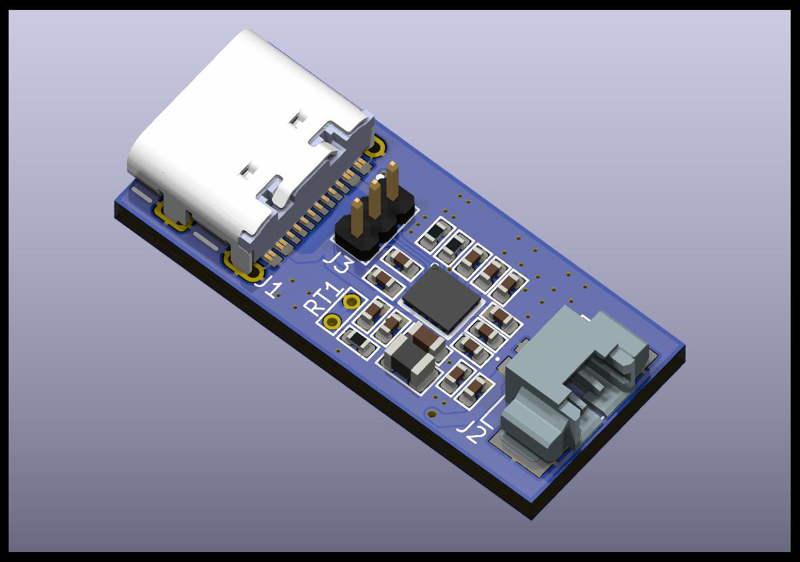

# Elastic Power Module

This repository contains the design and related files for the Elastic Power Module.

## Current Status
- [x] Schematic
- [x] PCB Design
- [x] Prototype
- [ ] Testing (** It is not tested yet, DO NOT use it as your reference design! **)

## Project Structure

- `elastic_power_module.kicad_pcb`: KiCad PCB design file.
- `elastic_power_module.kicad_prl`: KiCad project local settings file.
- `elastic_power_module.kicad_pro`: KiCad project file.
- `elastic_power_module.kicad_sch`: KiCad schematic file.
- `elastic_power_module.pdf`: PDF version of the schematic.
- `fp-info-cache`: Footprint info cache.
- `pictures`: Contains pictures of the assembled module.
  - `elastic_power_module_bottom_view.jpg`: Bottom view of the module.
  - `elastic_power_module_side_view.jpg`: Side view of the module.
  - `elastic_power_module_top_view.jpg`: Top view of the module.

## Getting Started

- To get started with this project, clone the repository and open the `.kicad_pcb` or `.kicad_sch` files in KiCad.
- Or you can just download the PDF version of the schematic and use it as your reference design.
- To assemble the module, you can use the interactive BOM file [here](https://htmlpreview.github.io/?https://github.com/SuperChange001/pmic-pcb/blob/master/bom/ibom.html).

## Contributing

Contributions are welcome. Please open an issue to discuss your idea or submit a Pull Request.

## License

[MIT](https://choosealicense.com/licenses/mit/)